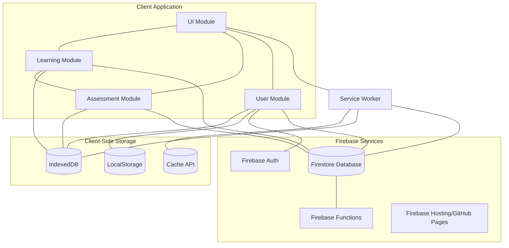
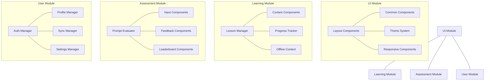
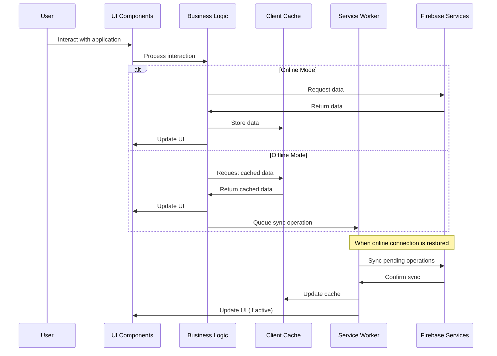
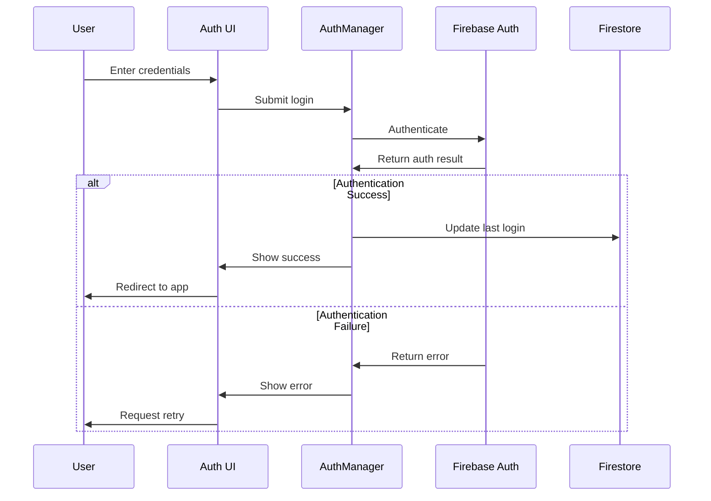
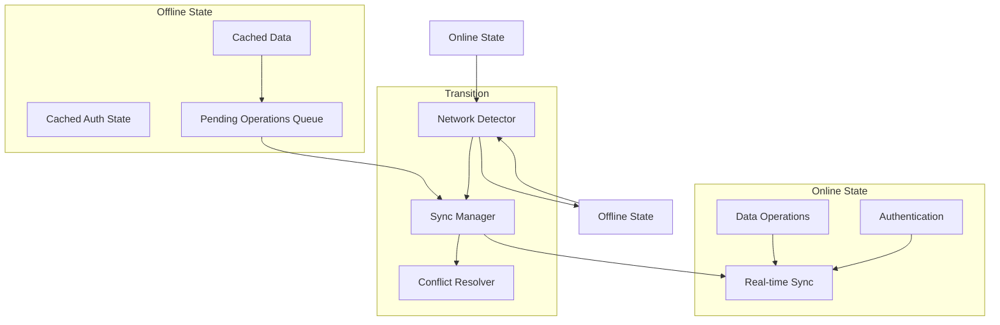
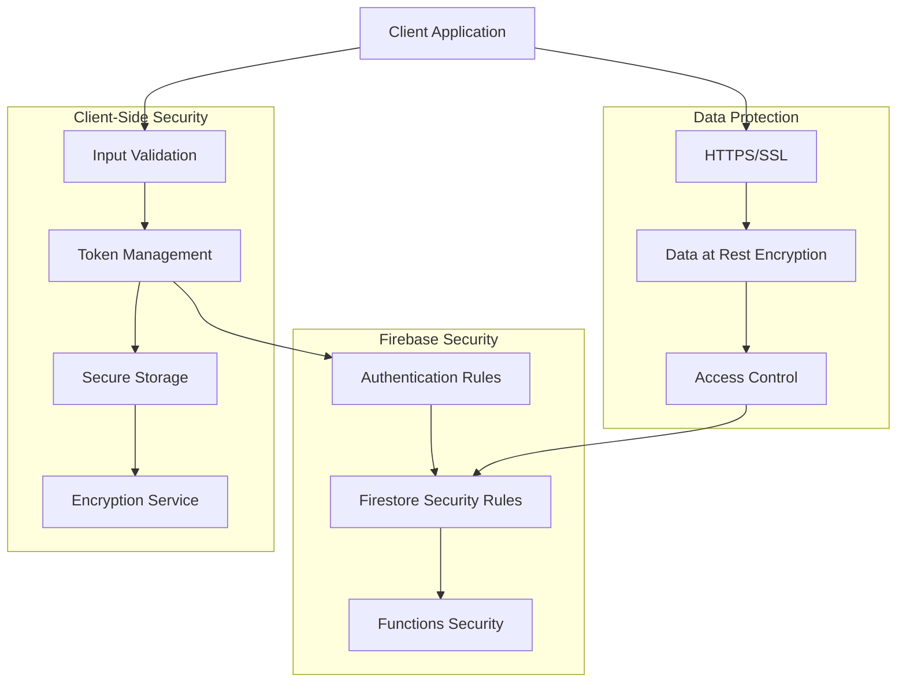
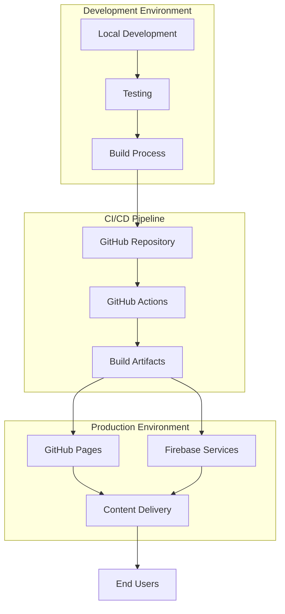
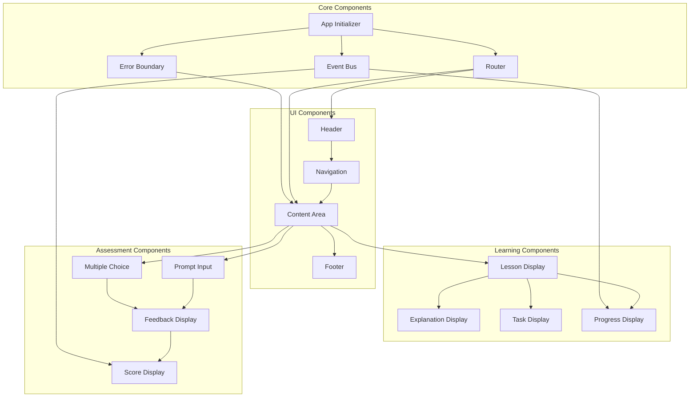

# Mistrz Promptów - Architecture Diagrams

This document contains visual representations of the "Mistrz Promptów" application architecture using Mermaid diagrams.

## System Architecture Diagram

## Module Structure Diagram

## Data Flow Diagram

## Authentication Flow Diagram

## Offline Capabilities Diagram

## Security Implementation Diagram

## Deployment Architecture Diagram

## Component Interaction Diagram

These diagrams provide a visual representation of the "Mistrz Promptów" application architecture, showing the relationships between components, data flow, and system interactions.
