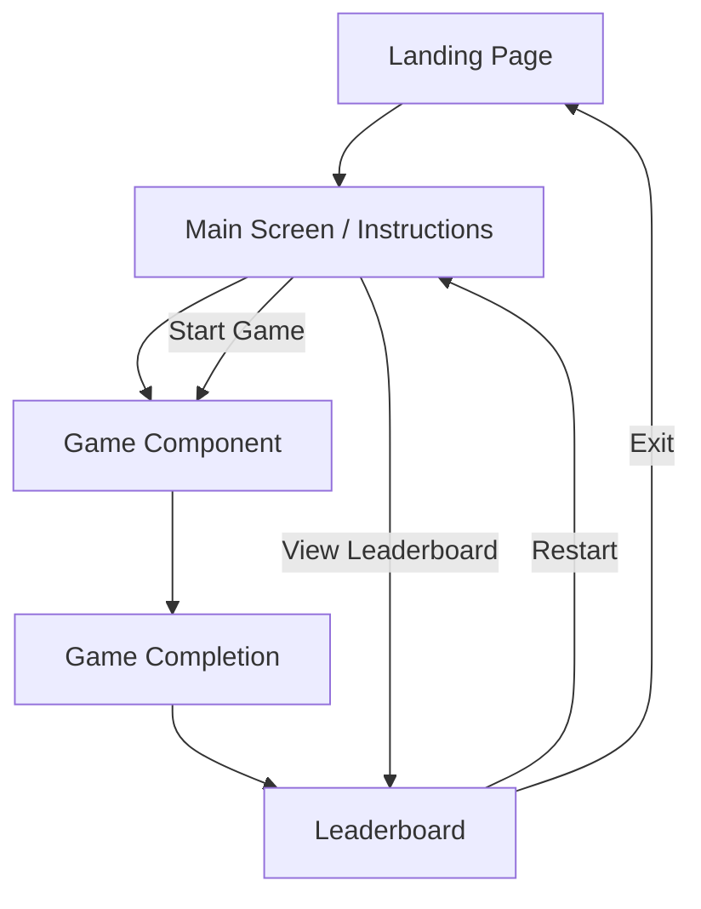
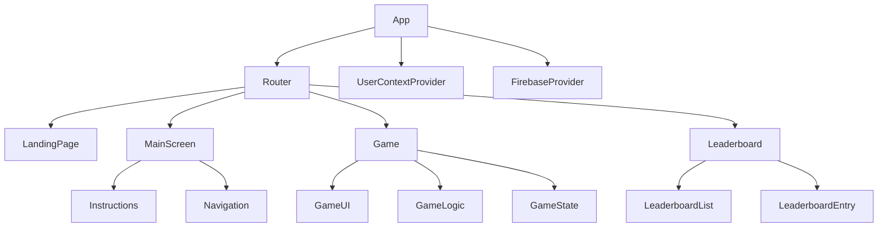
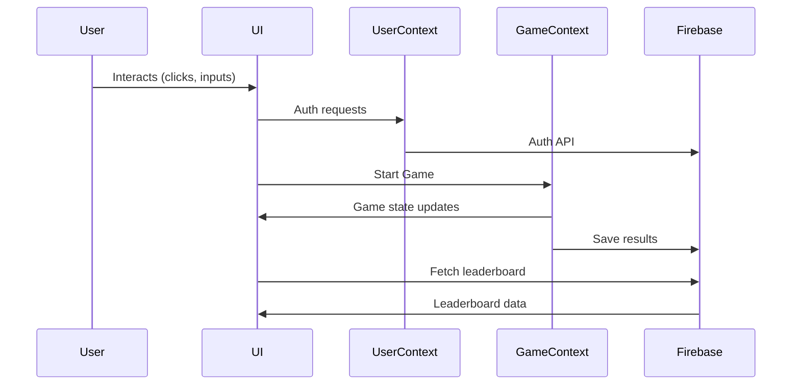

# Prompt Engineering E-Learning Platform: Unified Architecture

## 1. User Flow Overview



**Description:**

- Users arrive at the Landing Page.
- They proceed to the Main Screen, which provides clear instructions and navigation.
- From there, users can start the Game or view the Leaderboard.
- Upon game completion, users see their results and can view the Leaderboard or restart.

---

## 2. Component Hierarchy



**Key Components:**

- **App**: Root component, wraps providers and router.
- **Router**: Handles navigation between pages.
- **UserContextProvider**: Manages authentication and user state.
- **FirebaseProvider**: Supplies Firebase services (auth, db).
- **LandingPage**: Welcome and branding.
- **MainScreen**: Instructions and navigation.
- **Game**: Core gameplay logic and UI.
- **Leaderboard**: Displays user rankings.

---

## 3. Data Flow & State Management

- **Global State**: Managed via React Context (`UserContext`, `GameContext`).
- **Game State**: Local to Game component, synced to Firebase on completion.
- **Leaderboard Data**: Fetched from Firebase Firestore, cached in context for performance.
- **Navigation State**: Managed by React Router.



---

## 4. Firebase Integration

- **Authentication**: Email/password, Google, or anonymous sign-in.
- **Firestore**: Stores user progress, game results, leaderboard entries.
- **Security**: Follows rules in `firestore.rules` and `security-plan.md`.
- **Leaderboard**: Aggregates scores, supports pagination and real-time updates.

**Integration Points:**

- `src/firebase/` for config and utility functions.
- Context providers abstract Firebase logic from UI components.

---

## 5. Responsive Design Considerations

- Use CSS-in-JS or CSS modules for scoped, maintainable styles.
- Flexbox/Grid layouts for adaptive UI.
- Media queries for mobile/tablet/desktop breakpoints.
- Touch-friendly controls and accessible navigation.

---

## 6. Proposed Project Structure

```
src/
  components/
    LandingPage/
    MainScreen/
      Instructions.js
      Navigation.js
    Game/
      GameUI.js
      GameLogic.js
      GameState.js
    Leaderboard/
      LeaderboardList.js
      LeaderboardEntry.js
  context/
    UserContext.js
    GameContext.js
    FirebaseProvider.js
  firebase/
    firebase-config.js
    firestore-utils.js
    auth-utils.js
  utils/
    validation.js
    crypto.js
  styles/
    main.css
    variables.css
  App.js
  index.js
  service-worker.js
public/
  index.html
  favicon.ico
docs/
  architecture.md
  user-guide.md
  developer-documentation.md
  ...
```

---

## 7. Navigation & UX Patterns

- **Landing Page**: Branding, login/register, CTA to start.
- **Main Screen**: Instructions, navigation to game/leaderboard.
- **Game**: Clear progress indicators, feedback, pause/quit options.
- **Leaderboard**: Sortable, filterable, highlights current user.
- **Header/Footer**: Consistent navigation, responsive layout.

---

## 8. Security & Privacy

- No secrets in client code; use environment variables.
- Firestore rules restrict access to authenticated users.
- User data is only accessible to the user and for leaderboard aggregation.

---

## 9. Extensibility

- Modular component structure allows for easy addition of new games or learning modules.
- Context and provider pattern supports scalable state management.
- Firebase abstraction enables swapping backend if needed.

---

## 10. Diagram Legend

- **Rectangles**: Components or pages
- **Arrows**: Navigation or data flow
- **Providers**: Context/state wrappers

---

This architecture ensures a unified, maintainable, and scalable e-learning platform for prompt engineering, with a focus on user experience, robust data management, and clear project organization.
